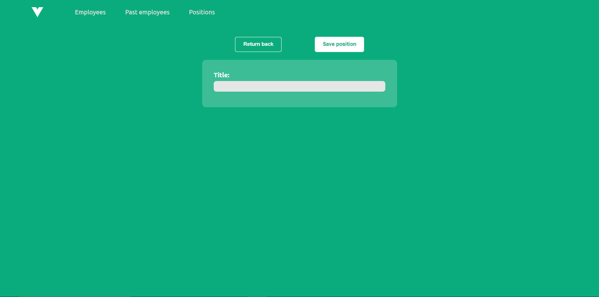

## An employee management SPA

### Used technologies:

-   Frontend: Vue 3 with Vite, Vuex, Vue Router, SCSS and Typescript
-   Backend: C#, ASP.NET Core Web API 6
-   Database: SQL, Microsoft SQL Server Express 2019

#### Every employee has to have the following data:

-   Firstname - required
-   Lastname - required
-   Address - optional
-   Date of birth - required, date from the past
-   Date of starting work - required, current or future date
-   Position - required
-   Salary - required, decimal number

#### The SPA supports the following operations:

-   Show list of current employees
-   Show list of past employees
-   Show data of a selected employee (by clicking on its name)
-   Create a new employee entry
-   Delete an existing employee entry
-   Show list of current positions in the company
-   Create a new position
-   Delete an existing position

### Application structure

The SPA consists of three main pages:

- one containing the list of current employees
- one containing the list of past employees
- one containing the list of current positions in the company

### Design overview

#### Current Employees page

The current employees page contains navigation links, an option to add a new employee and the actual table of current employees in the center. Each Employee entry in the table has associated options for editing his information and deleting (or archiving) him.

After choosing the 'Delete' option on an employee, a confirmation modal appears where the user can choose if he wants to delete the employee in question or archive him (move him to the past employees table).

If the user chooses the 'Edit' option on an employee, he will be redirected to a new page containing filled-in information about the chosen employee in editable text fields. The use can freely modify these information and save them to the database. The page for adding a new employee has the exact same design.

#### Past Employees page

The design of the page is virtually identical with the current employees page, albeit it doesn't contain the option to add a new employee.

#### Current Positions page

Here the user can find the list of currently available positions along with an option to add new ones. The user can, of course, delete positions too, but only if they are not assigned to any current employee.

The confirmation modal for deleting a position is also similar to the one found on the current employees page, but it is more simple because positions cannot be archived.

The page for inserting a new position entry can be accessed by clicking on the '+ new position' option. A position only needs a title which has to be unique - if a position with an identical name already exists in the system, the user will not be able to save it again.

Copyright &copy; 2022 Ján Ágh. All rights reserved.